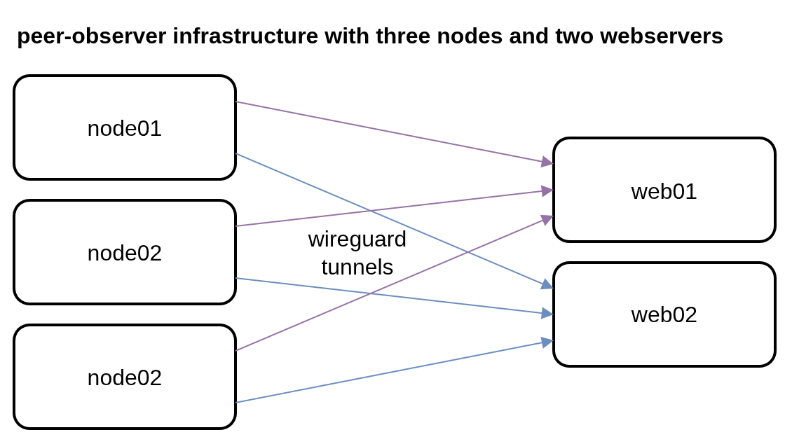
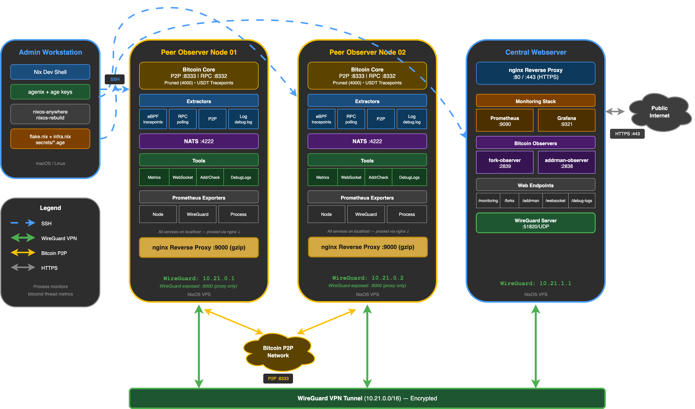

# peer-observer infrastructure library

A NixOS library flake for [peer-observer](https://github.com/peer-observer/peer-observer) Bitcoin P2P network monitoring infrastructure.

An infrastructure deployment consists of one or more node hosts and one or more webserver hosts. A host can be a VPS, VM, or dedicated machine.
Nodes are connected to webservers via wireguard.




A peer-observer node primarily runs a Bitcoin Core (or Bitcoin Knots, LibreRelay, ...) node.
From this node, multiple extractors (eBPF, RPC, P2P, debug-log) extract events.
These events are published into a [NATS](https://nats.io) server running on the host for inter-process communication.
The peer-observer tools subscribe to these events and process them (generate Prometheus metrics, bridge to websocket, ...).

All nodes connect to all peer-observer webservers via a wireguard tunnel.
Over the wireguard tunnel, a [Prometheus](https://prometheus.io/) instance fetches peer-observer and general system metrics from the nodes.
These metrics are visualized in pre-built [Grafana](https://grafana.com/) dashboards and can be used for alerting.
Additionally, webservers run a fork-observer instance, an addrman-observer instance, offer recent debug.logs from the nodes for download,
and host the peer-observer websocket tools to visualize node events in the browser.
These tools are reverse-proxied with an nginx webserver.
By default, the access to tools on the webserver is limited, but can be opened if required.



See [Architecture documentation](docs/architecture.md) for detailed component descriptions and data flow.

## Quick Start

To setup your own peer-observer infrastructure, you'll need:

- The [Nix package manager](https://nixos.org/download/) installed (NixOS Linux distro is not required)
- Linux hosts (x86_64 or aarch64) for node and webserver running e.g. Ubuntu / Debian (can be a VPS, VM, or dedicated machine)
- Root access to these hosts for initial deployment (we are going to wipe them and install NixOS on them)

This library provides a template for a peer-observer infrastructure. To use it, create a new folder and
navigate to it. There, initialize a new NixOS flake using the template.

```bash
# Initialize from template
mkdir my-peer-observer && cd my-peer-observer
nix flake init --template github:peer-observer/infra-library
```

Once your NixOS flake is initialized, enter the dev-shell

```bash
nix develop
```

and follow the [Quick Start Guide](docs/quickstart.md) for a full setup walkthrough.

## Documentation

- [Architecture](docs/architecture.md) - Components, data flow, and security boundaries
- [Configuration Concepts](docs/configuration.md) - Conceptual overview of `infra.nix`
- [Configuration Options Reference](https://peer-observer.github.io/infra-library/) - Complete option reference, auto-generated and always up to date
- [Secrets Management](docs/secrets.md) - Agenix setup and key management
- [Troubleshooting](docs/troubleshooting.md) - Common issues and solutions

## Resources

- [peer-observer](https://github.com/peer-observer/peer-observer) - Extractors and tooling
- [fork-observer](https://github.com/0xB10C/fork-observer) - Chain tip and fork monitoring
- [addrman-observer](https://github.com/0xB10C/addrman-observer) - Bitcoin node IP address manager visualization
- [b10c-nix](https://github.com/0xB10C/nix) - b10c's Nix package and module for peer-observer components
- [Disko](https://github.com/nix-community/disko) - Declarative disk partitioning used here
- [Agenix](https://github.com/ryantm/agenix) - Secrets management used here
- [nixos-anywhere](https://github.com/nix-community/nixos-anywhere) - Remote NixOS installation
- [Install NixOs on an OVH vps with nixos-anywhere](https://edouard.paris/notes/install-nixos-on-an-ovh-vps-with-nixos-anywhere/) - Blog post by Edouard Paris on using nixos-anywhere with OVH VPS
- [NixOS & Peer Observer on a VPS](https://deadmanoz.xyz/posts/2026/nixos-peer-observer-vps) - Blog post by deadmanoz on setting up peer-observer with NixOS on OVH VPS
